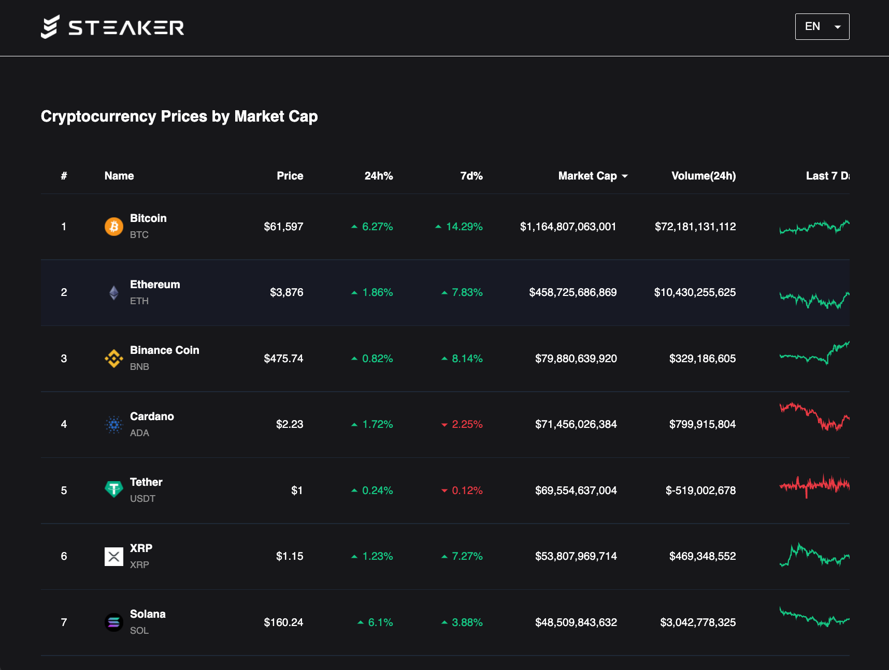

# Steaker Take-home Task

- Author: Brian Lai

This Project is for interviewing Steaker.

See [DEMO](https://steaker-task.netlify.app/)

> Warning:
> If you refresh the page too quickly, you will get a CORS error by the API provider ( not me! ).
> It will cause pagination disappear, please wait for a minute and then refresh page again, and it will be fixed.

### Stacks:

- Vue 3
- Vite
- Vuex
- Vue Router
- Vue i18n

### Other plugins:

- Axios
- Tailwindcss
- Nprogress
- Naive UI
- Lodash
- Chart.js

### Required Functions:

- Header, Footer
- Show Name, Price, 24hr changing, 7 days changing, market cap, and 24 hr volume of coins
- Coin table can be ordered by DESC or ASC
- Pagination with router
- Multilingual website with router and localStorage

### Bonus Functions:

- Freezing window effect of table header
- Sparkline of 7 days price changing

### Additional Functions:

- Loading Skeleton
- Loading Bar
- Error Notification
